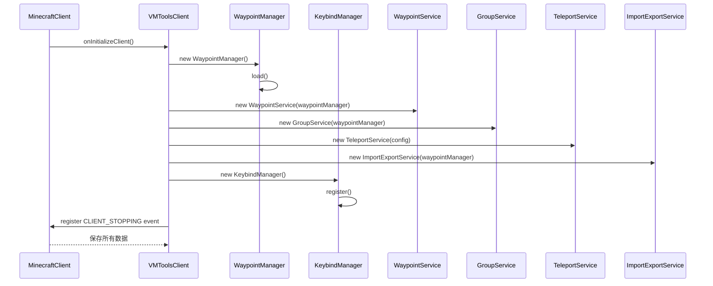
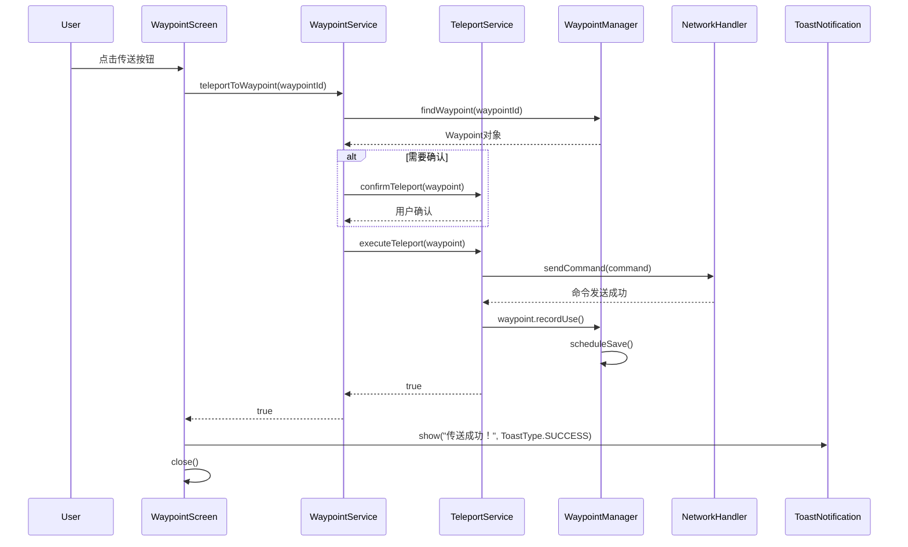
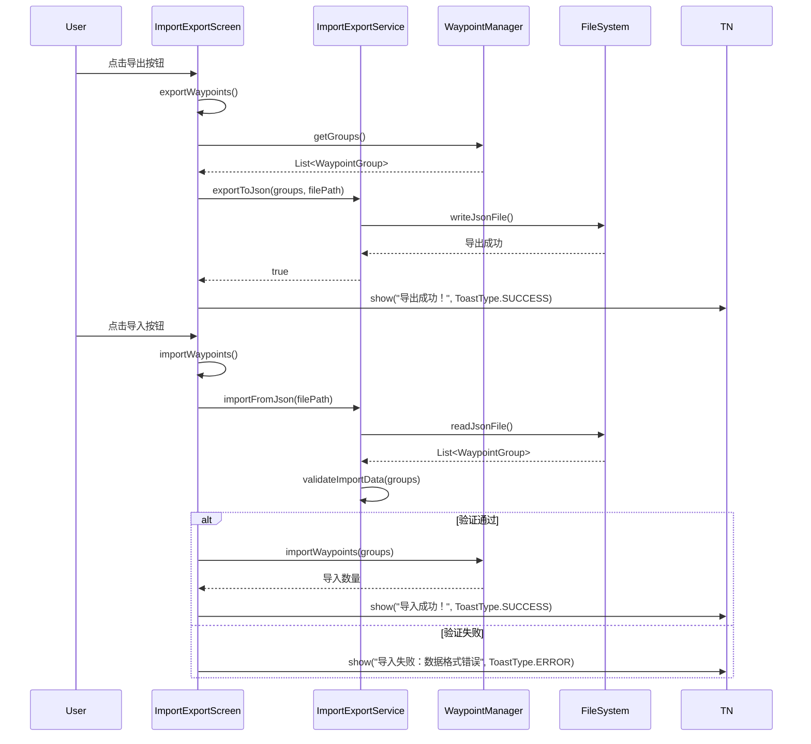
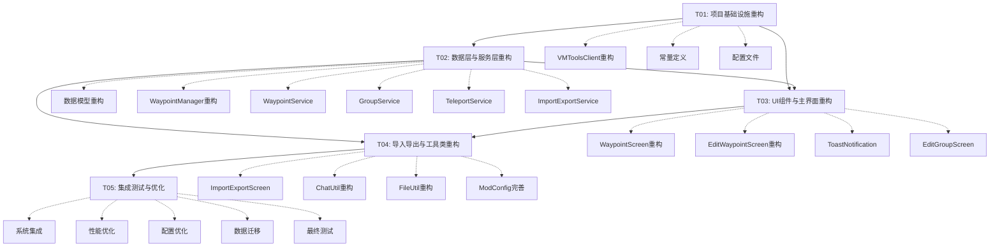

# VMTools 重构系统设计文档

## Part A: 系统设计

### 1. 实现方案

#### 1.1 核心技术挑战分析

1. **UI与业务逻辑耦合**: 现有`WaypointScreen`包含大量业务逻辑（传送、复制、删除、搜索等）
2. **功能缺失**: 添加分组界面、导入导出、输入验证、操作反馈等关键功能未实现
3. **魔法数字和重复代码**: UI颜色、尺寸常量分散在各个Screen类中
4. **性能问题**: 每次操作都立即保存到文件，搜索使用线性扫描

#### 1.2 框架选型

**核心框架选择：**
- **Fabric API**: 继续使用Fabric 1.21.11，保持与原版服务器的兼容性
- **Minecraft Screen系统**: 基于Fabric的Screen系统进行UI开发，保持原生风格
- **Gson**: 继续使用Gson进行JSON序列化/反序列化

**架构模式选择：**
- **简单分层架构**: 将UI（View）、业务逻辑（Service）、数据（Model）分离
- **服务类封装**: 将业务逻辑封装到独立的服务类中
- **工具类提取**: 将UI绘制工具方法提取到工具类中

#### 1.3 架构设计原则

1. **单一职责**: 每个类只负责一个功能领域
2. **简单实用**: 避免过度设计，保持代码简洁
3. **易于维护**: 提取常量，减少魔法数字
4. **功能完整**: 实现所有TODO功能

### 2. 文件列表

#### 2.1 修改文件
```
vmtools/
├── build.gradle                          # 确认依赖配置
├── gradle.properties                     # 保持现有配置
├── src/main/java/com/venus/vmtools/
│   ├── VMToolsClient.java                # 重构：移除单例，改为依赖注入
│   ├── config/ModConfig.java             # 重构：添加配置验证和默认值
│   ├── feature/waypoint/
│   │   ├── Waypoint.java                 # 重构：添加输入验证
│   │   ├── WaypointColor.java            # 保持现有功能
│   │   ├── WaypointGroup.java            # 重构：添加验证和事件
│   │   ├── WaypointIO.java               # 重构：实现导入导出功能
│   │   └── WaypointManager.java          # 重构：分离业务逻辑，添加延迟保存
│   ├── gui/
│   │   ├── WaypointScreen.java           # 重构：移除业务逻辑，使用服务层
│   │   └── EditWaypointScreen.java       # 重构：添加输入验证和反馈
│   ├── keybind/KeybindManager.java       # 保持现有功能
│   └── util/
│       ├── ChatUtil.java                 # 重构：添加操作反馈
│       └── FileUtil.java                 # 重构：优化文件操作
```

#### 2.2 新增文件
```
vmtools/
├── src/main/java/com/venus/vmtools/
│   ├── service/                          # 新增：服务层
│   │   ├── WaypointService.java          # 路径点业务逻辑服务
│   │   ├── GroupService.java             # 分组业务逻辑服务
│   │   ├── TeleportService.java          # 传送服务
│   │   └── ImportExportService.java      # 导入导出服务
│   ├── view/                             # 新增：UI视图层
│   │   ├── components/                   # UI组件
│   │   │   ├── ToastNotification.java    # 通知组件
│   │   │   └── UIConstants.java          # UI常量（颜色、尺寸）
│   │   └── screens/                      # 屏幕界面
│   │       ├── EditGroupScreen.java      # 编辑分组界面
│   │       └── ImportExportScreen.java   # 导入导出界面
│   └── constant/                         # 新增：常量定义
│       └── PathConstants.java            # 路径常量
```

### 3. 数据结构和接口

#### 3.1 类图设计

```mermaid
classDiagram
    class VMToolsClient {
        -ModConfig config
        -WaypointManager waypointManager
        -KeybindManager keybindManager
        -WaypointService waypointService
        -GroupService groupService
        -TeleportService teleportService
        -ImportExportService importExportService
        +onInitializeClient() void
        +saveAll() void
        +getConfig() ModConfig
        +getWaypointManager() WaypointManager
        +getKeybindManager() KeybindManager
        +getWaypointService() WaypointService
        +getGroupService() GroupService
        +getTeleportService() TeleportService
        +getImportExportService() ImportExportService
    }

    class ModConfig {
        -boolean confirmTeleport
        -float uiScale
        -int animationDuration
        +load() ModConfig
        +save() void
        +validate() boolean
    }

    class Waypoint {
        -String id
        -String name
        -String command
        -WaypointColor color
        -String groupId
        -LocalDateTime createdAt
        -LocalDateTime lastUsedAt
        -int useCount
        +recordUse() void
        +validate() boolean
        +getDisplayCommand() String
    }

    class WaypointGroup {
        -String id
        -String name
        -WaypointColor color
        -boolean expanded
        -List~Waypoint~ waypoints
        +addWaypoint(Waypoint) void
        +removeWaypoint(String) boolean
        +findWaypoint(String) Waypoint
        +validate() boolean
    }

    class WaypointManager {
        -List~WaypointGroup~ groups
        -DataManager dataManager
        +addGroup(WaypointGroup) void
        +removeGroup(String) boolean
        +findGroup(String) WaypointGroup
        +getGroups() List~WaypointGroup~
        +addWaypoint(String, Waypoint) boolean
        +removeWaypoint(String, String) boolean
        +findWaypoint(String) Waypoint
        +executeTeleport(Waypoint) boolean
        +searchWaypoints(String) List~Waypoint~
        +importWaypoints(List~WaypointGroup~) int
        +scheduleSave() void
        +forceSave() void
    }

    class WaypointService {
        -WaypointManager waypointManager
        +createWaypoint(String, String, String, WaypointColor) Waypoint
        +updateWaypoint(String, String, String, WaypointColor) boolean
        +deleteWaypoint(String) boolean
        +teleportToWaypoint(String) boolean
        +copyWaypoint(String) Waypoint
        +searchWaypoints(String) List~Waypoint~
    }

    class GroupService {
        -WaypointManager waypointManager
        +createGroup(String, WaypointColor) WaypointGroup
        +updateGroup(String, String, WaypointColor) boolean
        +deleteGroup(String) boolean
        +toggleGroupExpanded(String) void
    }

    class TeleportService {
        -ModConfig config
        +executeTeleport(Waypoint) boolean
        +confirmTeleport(Waypoint) void
        +sendCommand(String) void
    }

    class ImportExportService {
        -WaypointManager waypointManager
        +exportToJson(List~WaypointGroup~, Path) boolean
        +importFromJson(Path) List~WaypointGroup~
        +validateImportData(List~WaypointGroup~) boolean
    }

    class WaypointScreen {
        -WaypointService waypointService
        -GroupService groupService
        -List~WaypointGroup~ groups
        -WaypointGroup selectedGroup
        -Waypoint selectedWaypoint
        -TextFieldWidget searchField
        +init() void
        +render(DrawContext, int, int, float) void
        +mouseClicked(double, double, int) boolean
    }

    class EditWaypointScreen {
        -WaypointService waypointService
        -Waypoint editingWaypoint
        -WaypointGroup targetGroup
        -boolean isEditMode
        -TextFieldWidget nameField
        -TextFieldWidget commandField
        -WaypointColor selectedColor
        +init() void
        +render(DrawContext, int, int, float) void
        +saveWaypoint() void
    }

    class EditGroupScreen {
        -GroupService groupService
        -WaypointGroup editingGroup
        -boolean isEditMode
        -TextFieldWidget nameField
        -WaypointColor selectedColor
        +init() void
        +render(DrawContext, int, int, float) void
        +saveGroup() void
    }

    class ImportExportScreen {
        -ImportExportService importExportService
        -WaypointManager waypointManager
        +init() void
        +render(DrawContext, int, int, float) void
        +importWaypoints() void
        +exportWaypoints() void
    }

    class ToastNotification {
        -String message
        -ToastType type
        -long displayTime
        +show() void
        +render(DrawContext) void
    }

    class UIConstants {
        +BG_COLOR: int = 0xFF1E1E2E
        +PANEL_COLOR: int = 0xFF2D2D44
        +HEADER_COLOR: int = 0xFF3D3D5C
        +TEXT_COLOR: int = 0xFFE0E0E0
        +ACCENT_COLOR: int = 0xFF7C3AED
        +SUCCESS_COLOR: int = 0xFF4ADE80
        +DANGER_COLOR: int = 0xFFF87171
        +PANEL_WIDTH: int = 220
        +PANEL_HEIGHT: int = 180
        +PADDING: int = 8
    }

    class PathConstants {
        +DATA_DIR: String = "vmtools"
        +WAYPOINTS_FILE: String = "waypoints.json"
        +CONFIG_FILE: String = "vmtools.properties"
    }

    VMToolsClient --> ModConfig
    VMToolsClient --> WaypointManager
    VMToolsClient --> KeybindManager
    VMToolsClient --> WaypointService
    VMToolsClient --> GroupService
    VMToolsClient --> TeleportService
    VMToolsClient --> ImportExportService
    WaypointManager --> Waypoint
    WaypointManager --> WaypointGroup
    WaypointService --> WaypointManager
    GroupService --> WaypointManager
    TeleportService --> ModConfig
    TeleportService --> Waypoint
    ImportExportService --> WaypointManager
    ImportExportService --> WaypointGroup
    WaypointScreen --> WaypointService
    WaypointScreen --> GroupService
    EditWaypointScreen --> WaypointService
    EditGroupScreen --> GroupService
    ImportExportScreen --> ImportExportService
    ImportExportScreen --> WaypointManager
```



#### 3.2 接口定义

```java
// 业务逻辑服务接口
public interface WaypointService {
    Waypoint createWaypoint(String name, String command, String groupId, WaypointColor color);
    boolean updateWaypoint(String id, String name, String command, WaypointColor color);
    boolean deleteWaypoint(String id);
    boolean teleportToWaypoint(String id);
    Waypoint copyWaypoint(String id);
    List<Waypoint> searchWaypoints(String keyword);
}

public interface GroupService {
    WaypointGroup createGroup(String name, WaypointColor color);
    boolean updateGroup(String id, String name, WaypointColor color);
    boolean deleteGroup(String id);
    void toggleGroupExpanded(String id);
}

public interface TeleportService {
    boolean executeTeleport(Waypoint waypoint);
    void confirmTeleport(Waypoint waypoint);
    void sendCommand(String command);
}

public interface ImportExportService {
    boolean exportToJson(List<WaypointGroup> groups, Path filePath);
    List<WaypointGroup> importFromJson(Path filePath);
    boolean validateImportData(List<WaypointGroup> groups);
}
```

### 4. 程序调用流程

#### 4.1 应用初始化流程



#### 4.2 路径点传送流程



#### 4.3 导入导出流程



### 5. 待明确事项

1. **Minecraft版本兼容性**: 1.21.11版本API是否有特殊变化需要确认
2. **服务器权限**: 原版服务器是否限制`/res tp`等命令的使用
3. **数据迁移**: 现有用户数据如何迁移到重构后的版本（建议自动迁移）
4. **多语言支持**: 是否需要支持英文等其他语言（现有zh_cn.json和en_us.json）
5. **性能要求**: 大数据量（1000+路径点）下的具体性能要求
6. **UI缩放**: 具体的UI缩放比例范围和默认值
7. **动画时长**: 打开动画的具体时长范围和默认值
8. **文件选择**: 导入导出时的文件选择对话框实现方式

## Part B: 任务分解

### 6. 依赖包列表

```
# 核心依赖（已有）
- minecraft: 1.21.11
- fabric-loader: 最新稳定版
- fabric-api: 最新稳定版

# 构建工具
- fabric-loom: 1.7-SNAPSHOT
- gradle: 8.x

# 数据序列化（已有）
- com.google.code.gson:gson: 2.10.1

# 开发工具
- Java 21
- IDE: IntelliJ IDEA / Eclipse
```

### 7. 任务列表

#### T01: 项目基础设施重构
**任务ID**: T01
**任务名称**: 项目基础设施重构
**源文件**:
- `build.gradle` - 确认依赖配置
- `gradle.properties` - 版本配置
- `src/main/resources/fabric.mod.json` - 模组配置
- `src/main/java/com/venus/vmtools/VMToolsClient.java` - 入口重构
- `src/main/java/com/venus/vmtools/constant/PathConstants.java` - 路径常量
- `src/main/java/com/venus/vmtools/view/components/UIConstants.java` - UI常量

**依赖**: 无
**优先级**: P0
**详细任务**:
1. 重构VMToolsClient，移除单例模式，改为依赖注入
2. 创建常量类，提取魔法数字
3. 确认build.gradle依赖配置
4. 更新fabric.mod.json配置

#### T02: 数据层与服务层重构
**任务ID**: T02
**任务名称**: 数据层与服务层重构
**源文件**:
- `src/main/java/com/venus/vmtools/feature/waypoint/Waypoint.java`
- `src/main/java/com/venus/vmtools/feature/waypoint/WaypointGroup.java`
- `src/main/java/com/venus/vmtools/feature/waypoint/WaypointIO.java`
- `src/main/java/com/venus/vmtools/feature/waypoint/WaypointManager.java`
- `src/main/java/com/venus/vmtools/service/WaypointService.java`
- `src/main/java/com/venus/vmtools/service/GroupService.java`
- `src/main/java/com/venus/vmtools/service/TeleportService.java`
- `src/main/java/com/venus/vmtools/service/ImportExportService.java`

**依赖**: T01
**优先级**: P0
**详细任务**:
1. 重构数据模型，添加输入验证
2. 重构WaypointManager，添加延迟保存机制
3. 创建WaypointService，实现路径点业务逻辑
4. 创建GroupService，实现分组业务逻辑
5. 创建TeleportService，实现传送逻辑
6. 创建ImportExportService，实现导入导出功能

#### T03: UI组件与主界面重构
**任务ID**: T03
**任务名称**: UI组件与主界面重构
**源文件**:
- `src/main/java/com/venus/vmtools/gui/WaypointScreen.java`
- `src/main/java/com/venus/vmtools/gui/EditWaypointScreen.java`
- `src/main/java/com/venus/vmtools/view/components/ToastNotification.java`
- `src/main/java/com/venus/vmtools/view/screens/EditGroupScreen.java`

**依赖**: T01, T02
**优先级**: P1
**详细任务**:
1. 重构WaypointScreen，移除业务逻辑，使用服务层
2. 重构EditWaypointScreen，添加输入验证和反馈
3. 创建ToastNotification组件，实现操作反馈
4. 创建EditGroupScreen，实现添加分组界面
5. 更新UI常量类，统一管理颜色和尺寸

#### T04: 导入导出与工具类重构
**任务ID**: T04
**任务名称**: 导入导出与工具类重构
**源文件**:
- `src/main/java/com/venus/vmtools/view/screens/ImportExportScreen.java`
- `src/main/java/com/venus/vmtools/util/ChatUtil.java`
- `src/main/java/com/venus/vmtools/util/FileUtil.java`
- `src/main/java/com/venus/vmtools/config/ModConfig.java`

**依赖**: T02, T03
**优先级**: P1
**详细任务**:
1. 创建ImportExportScreen，实现导入导出界面
2. 重构ChatUtil，添加操作反馈
3. 重构FileUtil，优化文件操作
4. 完善ModConfig，添加配置验证和默认值

#### T05: 集成测试与优化
**任务ID**: T05
**任务名称**: 系统集成与性能优化
**源文件**:
- 所有文件 - 最终集成
- `src/main/java/com/venus/vmtools/keybind/KeybindManager.java` - 快捷键优化

**依赖**: T04
**优先级**: P2
**详细任务**:
1. 集成所有模块，确保功能正常
2. 优化性能，实现延迟保存和搜索缓存
3. 完善配置系统，支持UI缩放和动画配置
4. 添加数据迁移功能，兼容旧版本数据
5. 最终测试和调试

### 8. 共享知识

#### 8.1 代码规范
- **命名规范**: 类名PascalCase，方法名camelCase，常量UPPER_SNAKE_CASE
- **包结构**: 按功能模块划分，每个模块包含service、view、model
- **注释规范**: 所有公共方法必须有JavaDoc注释
- **异常处理**: 所有文件操作必须有try-catch，记录日志

#### 8.2 UI设计规范
- **颜色主题**: 暗色主题，使用UIConstants中定义的颜色
- **布局规范**: 使用PANEL_WIDTH、PANEL_HEIGHT、PADDING等常量
- **交互规范**: 所有操作必须有反馈（Toast通知）
- **动画规范**: 使用ModConfig中配置的动画时长

#### 8.3 数据规范
- **文件格式**: JSON格式，使用Gson序列化
- **文件路径**: `config/vmtools/waypoints.json`
- **数据验证**: 所有数据必须通过validate()方法验证
- **备份机制**: 重要操作前自动备份

### 9. 任务依赖图



## 附录

### A. 关键设计决策

1. **简单分层架构**: 选择简单分层而非完整MVC，因为Minecraft Screen系统更适合直接操作
2. **服务类封装**: 将业务逻辑封装到独立的服务类中，提高代码可维护性
3. **延迟保存**: 使用Timer实现延迟保存，避免频繁IO操作
4. **UI工具类提取**: 将UI绘制工具方法提取到工具类中，减少重复代码

### B. 风险评估

1. **版本兼容性风险**: Minecraft 1.21.11 API变化可能影响实现
2. **性能风险**: 大数据量下的UI渲染和搜索性能
3. **数据迁移风险**: 旧版本数据格式兼容性
4. **用户体验风险**: 新UI设计可能影响用户习惯

### C. 测试策略

1. **单元测试**: 测试业务逻辑和数据模型
2. **集成测试**: 测试模块间交互
3. **UI测试**: 测试界面交互和用户体验
4. **性能测试**: 测试大数据量下的性能表现